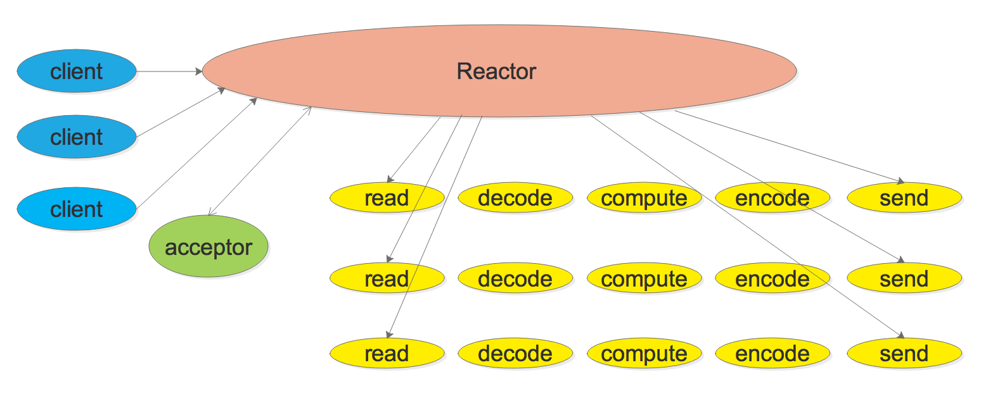
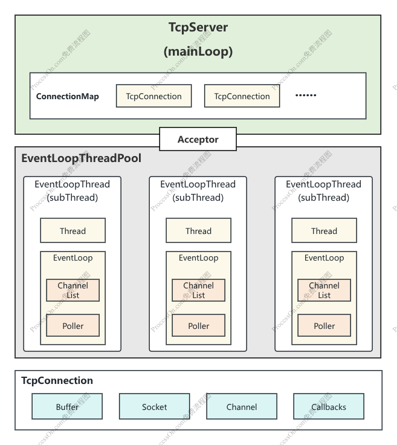

> [!NOTE]
>
> 一、参考视频：手写C++ Muduo网络库项目——施磊
>
> 二、可以通过检索 NOTE 来获取笔记中标注的要点设计
>
> 三、该文档为本人跟随视频学习过程中所总结，在跟写结束后对库进行压测时修改了部分bug，因此现在部分代码可能与本文档不一致，请以实际代码为准




​													(上图源自网络)




# 概述

muduo库最重要的三个类：EventLoop、Channel、Poller

其中，一个线程对应一个EventLoop（即one loop per thread），一个EventLoop拥有一个ChannelList与一个Poller，而Poller下监听了多个Channel，这也是为什么ChannelList不能直接对Channel进行修改，需要传递给上层，上层再传递给Poller,Poller再传递给下层Channel进行处理


# Logger类

## 作用

​	日志工具类，为整个网络库提供一个可以复用的日志工具

## 特点

​	1、单例模式

​	2、定义了INFO、ERROR、FATAL、DEBUG四个级别的宏

## 成员函数

### 	1、static Logger &instance()

​			在单例模式中，获取日志唯一对象，初次调用该函数时，static局部变量在第一次调用instance（）时被初始化，且只初始化一次。之后的调用会直接返回该静态变量的引用，static确保之后所有调用都返回同一个对象（C++11 保证了局部静态变量初始化的线程安全性）。

### 	2、私有构造函数

​			确保外部代码无法直接创建logger类，从而达到限制多个实例产生的目的。

## 成员变量

### 	1、int logLevel_

​			日志级别


# TimeStamp类

## 作用

​	时间工具类，为整个网络库提供一个统一的时间工具

## 特点

​	1、提供默认构造与单参构造两种方式

​	2、本类为对time.h的简易封装

​	3、严格构造

## 成员函数

### 	1、static Timestamp now()

​			返回系统当前时间

### 	2、std::string toString() const

​			提供格式化时间的功能，将类存储的时间戳转换为YYYY/MM/DD HH:MM:SS的格式

## 成员变量

### 	1、int64_t microSecondsSinceEpoch_

​			该类存储的时间戳


# InetAddress类

## 作用

​	封装socket地址类型，为网络库提供一个简易的地址工具

## 特点

​	1、严格构造

​	2、提供利用端口与ip构造以及直接利用sockaddr_in构造两种方式

​	3、本类为对C++网络地址sockaddr_in的封装

## 成员函数

### 	1、std::string toIP() const

​			将类成员addr_通过C标准库inet.h提供的方法转换为 ip地址 形式，通过char数组返回

### 	2、std::string toIpPort() const

​			将类成员addr_通过C标准库inet.h提供的方法转换为 ip地址:端口 形式，通过char数组返回

### 	3、uint16_t toPort() const

​			将类成员addr_通过C标准库inet.h提供的方法转换为 端口 形式，通过uint16_t

### 	4、const sockaddr_in *getSockAddr() const

​			返回一个指向类成员的sockaddr_in const指针

## 成员变量

### 	1、sockaddr_in addr_

​			存储C++网络库所需的地址信息


# Channel类

## 作用

​	封装socketfd与其关心的事件，如EPOLLIN、EPOLLOUT等，还绑定了poller返回的具体事件

## 特点

​	1、通过EventLoop与fd两个参数进行构造

## 成员函数

### 	1、void tie(const std::shared_ptr\<void> &)

​		绑定外部对象（如上层对象）的弱引用，这是为了解决 **TcpConnection 被销毁时，Poller 刚好返回了该 Channel 的事件**这一竞态条件。利用 `weak_ptr::lock()` 提升为 `shared_ptr`，在 `handleEventWithGuard` 作用域内确保了 `TcpConnection` 的存活。

### 	2、void handleEvent(Timestamp receiveTime)

​		事件分发，根据tie判定绑定的对象是否存在，若存在则继续处理，不存在则退出；若未绑定对象则直接开始事件处理

### 3、void handleEventWithGuard(Timestamp receiveTime)

​		实际处理事件的函数，根据Poller通知到Channel发生的不同事件类型，由Channel调用不同的回调函数进行处理。该函数处理了EPOLLHUP、EPOLLERR、EPOLLIN、EPOLLPRI、EPOLLOUT等事件

### 	4、void setReadCallBack(ReadEventCallBack cb)等

​		设置回调函数对象

### 	5、void (enable/disable) Reading/Writting/All()

​		这些函数用于修改fd感兴趣的事件并通知Poller更新监听事件

### 	6、void remove/update()

​		通过Channel所属的EventLoop，调用其所属的Poller的相应函数来修改fd的events事件，这也是Channel、EventLoop、Poller协作的关键所在


## 成员变量

### 	1、static const int kNoneEvent，kReadEvent，kWriteEvent

​			三种不同状态，分别为无事件、可读事件、可写事件

### 	2、EventLoop *loop_

​			表明自己所属的事件循环，用于调用事件循环的update与remove方法，从而更新Poller中的事件监听

### 	3、const int fd_

​			该channel所封装的套接字

### 	4、int events_

​			该channel所注册的感兴趣的事件

### 	5、int revents_

​			该channel从Poller中接受到的实际发生的事件

### 	6、int index_

​			用于标记channel在EPollPoller中的状态

### 	7、std::weak_ptr\<void> tie_

​			绑定外部对象的弱指针，用于外部检测对象是否存活

### 	8、bool tied_

​			表示是否通过tie()绑定了外部对象

### 	9、ReadEventCallBack(std::function<void(Timestamp)>) readCallBack_

​			可读事件回调，接受一个事件发生时间

### 	10、EventCallBack(std::function<void()>) writeCallBack，closeCallBack，errorCallBack_

​			可写、关闭、错误事件回调


# Poller类

## 作用

​	提供一个抽象层以实现对poll与epoll两种IO多路复用的支持

## 构造

​	1、接受一个EventLoop参数进行构造

## 成员函数

### 	1、virtual Timestamp poll(int timeoutMs, ChannelList(std::vector<Channel *>) *activeChannels) = 0

​			为poll与epoll提供的wait接口

### 	2、virtual void updateChannel(Channel *Channel) = 0 与 virtual void removeChannel(Channel *Channel) = 0

​			为poll与epoll提供的remove/update事件接口

### 	3、bool hasChannel(Channel *channel) const

​			判断传入的channel是否在当前poller中

### 	4、static Poller *newDefaultPoller(EventLoop *loop)

​			EventLoop可以通过该函数获取默认的IO复用的具体实现（即获取poll或者epoll）

> [!NOTE]
>
> 该函数并不在Poller.cpp中实现，而是在一个单独的公共文件DefaultPoller,cpp中进行实现。因为该函数返回PollPoller或EpollPoller的指针，因此必然需要在实现文件中包含对应的头文件。而Poller作为基类，应尽量避免出现基类包含派生类头文件的情况，因此将其放在单独文件中实现是一个良好的工程实践。


## 成员变量

### 	1、ChannelMap(std::unordered_map<int, Channel *>) channels_

​			通过该map保存本poller所管理的channel指针，key为socketfd,value为channel *

### 	2、EventLoop *ownerLoop_

​			保存本poller所归属的EventLoop的指针


# EPollPoller类

## 作用

​	该类为对Poller类的继承实现，作为muduo库支持epoll的手段，使用epoll方法对Poller类中的虚函数进行重写

## 成员函数

### 		1、fillActiveChannels(int numEvents, ChannelList *activeChannels) const

​			该函数用于填写活跃的连接

### 		2、update(int operation, Channel *channel)

​			该函数用于更新channel通道

​			channel发起update传递给EventLoop，随后EventLoop调用Poller的updateChannel，进而调用到EPollPoller的该函数完成最终对epoll事件的更改

## 其它

### 	1、int epoll_create1(int flags)

	        If flags is 0, then, other than the fact that the obsolete  size  argu‐
	       ment  is  dropped,  epoll_create1() is the same as epoll_create().  The
	       following value can be included in flags to obtain different behavior:
	
	       EPOLL_CLOEXEC
	              Set the close-on-exec (FD_CLOEXEC) flag on the new file descrip‐
	              tor.   See  the description of the O_CLOEXEC flag in open(2) for
	              reasons why this may be useful.

```
        当 flags 参数为 0 时，除了省略已废弃的 size 参数之外，epoll_create1() 的功能与                                       epoll_create() 完全相同。可以通过在 flags 中包含以下值来获得不同的行为：

        EPOLL_CLOEXEC
        	为新创建的文件描述符设置“执行时关闭”（FD_CLOEXEC）标志。关于此标志用途的说明，可参                                       考 open(2) 中对 O_CLOEXEC 标志的描述。
```

​		该函数与epoll_create（int size）的区别在于，废弃了已弃用的size参数（实际上epoll_create也已经忽略了这个参数），同时引入了创建选项**`EPOLL_CLOEXEC`**，同时该操作为原子操作，创建好时即同时设置好标志位

​		**`EPOLL_CLOEXEC`**

​			该标志位主要作用即防止文件描述符泄漏，让epoll文件描述符在执行exec（）系列函数时自动关闭，防止文件描述符被不必要的子进程继承。

### 	2、epoll_event结构体

```
        typedef union epoll_data
        {
          void *ptr;
          int fd;
          uint32_t u32;
          uint64_t u64;
        } epoll_data_t;
        struct epoll_event
        {
          uint32_t events;  /* Epoll events */
          epoll_data_t data;    /* User data variable */
        }
```

​		该结构体为epoll_ctl（）调用时需要传递的结构体，其中events描述了被传入epoll的描述符所感兴趣的事件，而data则由开发者自行决定需要保存的数据，以便epoll_wait（）返回时携带该描述符的具体信息。在muduo库中，data保存了指向channel的指针，方便后续epoll_wait返回时对channel进行设置。


# EventLoop类

## 作用

​	该类为Muduo的核心类之一，协调Poller与Channel进行交互以及事件的管理与传递

## 成员函数

### 1、void loop()

​	启动事件循环

### 2、void quit()

​	结束事件循环

### 3、Timestamp pollReturnTime()

​	取值函数

### 4、void runInLoop(Functor(std::function<void()>) cb)

​	在当前loop中直接执行cb

### 5、void queueInLoop(Functor cb)

​	将cb放入队列中，唤醒loop所在线程并执行cb

### 6、void wakeup()

​	用于唤醒loop所在线程

### 7、void update/remove Channel(Channel *channel)

​	EventLoop调用Poller的函数以更新channel

### 8、bool hasChannel(Channel *channel)

​	检查channel是否在当前loop中

### 9、bool isInLoopThread()

​	判断loop对象是否在创建自己的线程里面

### 10、void handleRead()

​	wake up

### 11、void doPendingFunctors()

​	执行回调函数

​	

> [!NOTE]
>
> 此函数实现有一个小细节，通过预先创建一个空容器，然后将其与待执行的，且被锁保护的回调函数队列swap，以此避免了对回调函数队列进行范围for，从而导致其他loop一直无法访问队列向其添加新回调。
>
> 这样做之后，能够只在swap时加锁，随后立即解锁回调队列，从而大幅降低延迟


## 成员变量

### 1、std::atomic_bool looping_

​	该变量用于标识EventLoop循环是否在正常进行

### 2、std::atomic_bool quit_

​	用于标识loop循环是否已退出

### 3、const pid_t threadId_

​	用于记录当前loop所在线程的tid

### 4、Timestamp pollReturnTime_

​	poller返回发生事件的channels的时间点

### 5、std::unique_ptr\<Poller> poller_

​	指向loop所管理的poller

### 6、int wakeupFd_

​	当mainLoop获取到一个新的channel时，通过轮询算法选择一个subLoop,则可以通过该成员唤醒subLoop来处理channel

### 7、std::unique_ptr\<Channel> wakeupChannel_

​	封装了wakeupFd与Channel

### 8、ChannelList activeChannels_

​	当前活跃的channel列表

### 9、Channel *currentActiveChannel_

​	当前处于活跃状态的channel

### 10、std::atomic_bool callingPendingFunctors_

​	表示当前loop是否有需要执行的回调操作

### 11、std::vector\<Functor> pendingFunctors_

​	存储loop所需要执行的所有回调操作

### 12、 std::mutex mutex_

​	用于保护上面vector容器的线程安全


## 其它

### 1、thread_local

​	用来声明变量为线程级变量而不是全局变量，防止某些变量被全局共享

### 2、::eventfd()

​	位于<sys/eventfd.h>，为linux系统调用

​	作用为创建一个用于线程通信的中间人，当B线程有事件时可以通知eventfd，eventfd累积计数，随后eventfd会唤醒本fd对应的线程来处理该事件。在该模块中，eventfd的作用为唤醒subReactor

> [!NOTE]
>
> muduo库通过这个机制避免了线程竞争，mainLoop持有每个subLoop的wakeupFd，当有事件需要subLoop处理时，mainLoop向subLoop写入一个8字节数据从而唤起处于epoll_wait状态的subLoop（wakeupFd也被封装为了wakeupChannel并注册在Poller上监听），在回调中调度subLoop去执行队列中的任务。


# Thread类

## 作用

​	该类为为实现EventLoopThreadPool而准备的底层Thread封装

## 成员函数

### 1、void start()

​	该函数启动一个新的thread

### 2、void join()

​	该函数将阻塞等待子线程结束

> [!NOTE]
>
> 有另一种线程结束方式为detach()，与join不同的是，detach结束子线程是后台任务，不会阻塞主线程继续执行，且主线程不需要知道detach的执行结果


### 3、void setDefaultName()

​	该函数将为线程以{Thread:$线程序号}的方式设置默认名称

## 成员变量

### 1、bool started_

​	标识线程是否已经启动

### 2、bool joined_;

​	标识线程是否为等待结束状态

### 3、std::shared_ptr\<std::thread> thread_

​	用于保存一个指向thread的指针

> [!NOTE]
>
> 为什么这里不直接使用thread类型来保存thread_？
>
> 因为根据C++标准，thread类在构造时将直接创建一个线程并启动，因此为了保留库对线程启动时间的控制，采用智能指针的方式避免提前启动


### 4、pid_t tid_

​	用于标识线程的tid

### 5、ThreadFunc func_

​	用于保存线程需要执行的任务

### 6、std::string name_

​	线程名称

### 7、static std::atomic_int32_t numCreated_

​	静态计数器，用于统计创建的线程数量


# EventLoopThread类

## 作用

​	该类为Thread类的进一步封装，管理了Thread与其相对应的EventLoop，也真正体现了One loop per thread

## 成员函数

### 1、EventLoop* startLoop()

​	启动本类所管理的底层新线程

> [!NOTE]
>
> 此处为One loop per thread的核心体现
>
> 具体来说，当EventLoopThread类构造时，会将threadFunc()传递给底层Thread类，而Thread类在构造时会把此函数注册为需要在线程启动后立即执行的函数。而在本函数中，启动底层线程之后会阻塞在while (loop_ == nullptr)，等待底层线程完成启动，并真正执行threadFunc()时，才会创建一个loop对象，同时处理完回调之后将loop对象绑定到EventLoopThread类的loop_上，随后执行loop()开始进行事件循环
>
> 相关函数：EventLoopThread::threadFunc()、Thread::start()


### 2、void threadFunc()

​	该函数为新线程所执行的函数，在此函数中创建了新线程自己的EventLoop对象，并在执行完由主线程传递过来的回调函数之后将EventLoop对象绑定到EventLoopThread的loop_，随后执行EventLoop::loop()开始本线程的事件循环

## 成员变量

### 1、EventLoop *loop_

​	指向本类所管理的线程的EventLoop对象

### 2、bool exiting_

​	标识类是否处于析构状态

### 3、std::mutex mutex_

​	用于保护对loop_的操作

### 4、std::condition_variable cond_

​	用于配合mutex

### 5、ThreadInitCallback callback_

​	用于设置需要传递给底层线程执行的回调函数


# EventLoopThreadPool类

## 作用

​	该类封装EventLoopThread而实现了一个线程池，用于管理mainLoop与其它subLoop

## 成员函数

### 1、void EventLoopThreadPool::start(const ThreadInitCallback &cb)

​	该函数启动整个线程池，会根据设置的numThreads_而启动相应数量的subLoop,若numThreads_为0则只启动mainLoop

### 2、EventLoop *EventLoopThreadPool::getNextLoop()

​	该函数用于实现轮询获取subLoop

### 3、std::vector<EventLoop *> EventLoopThreadPool::getAllLoops()

​	该函数返回所有的subLoop

## 成员变量

### 1、EventLoop *baseLoop_

​	用于保存mainLoop

### 2、std::string name_

​	保存线程名

### 3、bool started_

​	标识线程池是否已启动

### 4、int numThreads_

​	保存允许的线程数量，若为0则只有mainLoop

### 5、int next_

​	用以轮询查找Loop

### 6、std::vector\<std::unique_ptr\<EventLoopThread>> threads_

​	用于保存所有subThread

### 7、std::vector<EventLoop *> loops_

​	用于保存所有subLoop


# Socket类

## 作用

​	此类为对底层socket的封装，使其更好的与此前封装的InetAddress配合

## 成员函数

### 1、void bindAddress(const InetAddress &Localaddr)

### 2、void listen()

​	上述两个函数为对底层socket调用bind与listen

### 3、int accept(InetAddress *peeraddr)

​	接受一个新的连接，向peeraddr写入新连接的地址，并返回新连接的fd

## 成员变量

### 1、const int sockfd_

​	封装的底层socket


# Acceptor类

## 作用

​	该类为事件分发器（连接接受器），运行在mainLoop中，负责从mainLoop接受新的连接并将其分发到subLoop中

## 成员函数

### 1、（非成员）static int createNonblocking()

​	用于创建一个非阻塞的socket

### 2、Acceptor(EventLoop *loop, const InetAddress &listenAddr, bool reuseport)

​	在构造时设置由createNonblocking创建的套接字为REUSE，允许复用地址与端口，随后将传入的Addr绑定。并为其设置读事件的回调为handleRead()

### 3、~Acceptor()

​	将套接字的所有监听均关闭，随后通知套接字让其从Poller中移除

### 4、void listen()

​	开始监听连接，启用channel的读事件监听以及将其注册到Poller

### 5、void Acceptor::handleRead()

​	私有函数，为构造时传递给channel的读回调。当处于监听状态的channel有新事件发生时（即新用户连接），将调用accept接受连接，并获取connfd与客户端地址。随后调用预先设置的新连接回调函数newConnectionCallback_。


## 成员变量

### 1、EventLoop *loop_

​	指向 mainLoop（baseLoop）。Acceptor 必须运行在 mainLoop 中，负责接受新连接。

### 2、Socket acceptSocket_

​	封装listenfd

### 3、Channel acceptChannel_

​	封装 listenfd 对应的 Channel

### 4、NewConnectionCallback newConnectionCallback_

​	新连接回调函数，类型为 std::function<void(int sockfd, const InetAddress &)>。

### 5、bool listening_

​	标识是否处于监听状态

### 6、int idleFd_

​	占位文件符，用于解决EMFILE问题

> [!NOTE]
>
> 当并发连接数过多时，系统fd可能会被快速耗尽。有新连接到来就会accept失败并触发EMFILE
>
> 但是，muduo的epoll是采用水平触发（LT）模式，因此只要listenfd上有尚未处理的连接时就会持续触发accept，因此引入闲散文件符可以在检测到触发EMFILE信号时关闭占位文件，然后接受新的连接，再关闭新的连接，最后重新打开占位文件，这样可以避免新连接持续触发accept。


# Buffer类

## 作用

​	为网络库提供一个可用的缓冲区类，结构如下

+-------------------------------------+-----------------------------------+--------------------------------+
|      prependable bytes      |        readable bytes         |          writable bytes     |
|                                              |           (CONTENT)            |                                        |
+-------------------------------------+-----------------------------------+--------------------------------+
|                                              |                                           |                                        |
 0            <=              readerIndex         <=         writerIndex         <=          size

## 成员函数

### 1、size_t readableBytes() const

​	返回可读的数据大小

### 2、size_t writableBytes() const

​	返回可写的数据大小

### 3、size_t prependableBytes() const

​	返回可预留空间大小，即从缓冲区起始到读指针的距离

### 4、const char *peek() const

​	返回缓冲区中可读数据的起始地址，用于查看数据但不移动读取指针

### 6、void retrieve(size_t len)

​	移动读指针后移len长度

### 7、void retrieveAll()

​	将读写指针全部移到开始，表示数据全部读取

### 8、std::string retrieveAllAsString()

​	读取所有数据并作为string返回

### 9、std::string retrieveAsString(size_t len)

​	读取len长度的数据并作为string返回

### 10、void ensureWritableBytes(size_t len)

​	用来保证有足够的空间写数据

### 11、char *beginWrite()

​	返回写指针所在位置

### 12、const char *beginWrite() const

​	常量方式返回写指针所在位置

### 13、void append(const char *data, size_t len)

​	追加data数据到缓冲区

### 14、ssize_t readFd(int fd, int *savedErrno)

​	从fd上直接读取数据，每次最多读取64K数据

> [!NOTE]
>
> Muduo库的Poller工作在LT模式下，因此如果有未读完的数据则会一直上报


> [!NOTE]
>
> TCP数据的长度是不可预知的，因此这个函数的实现使用了linux提供的系统调用readv，该函数支持指定多个输出区依次写入，因此在这个函数的实现中使用了临时的栈上变量char数据做备用缓冲，若buffer本身的可写大小不足以写下数据，则readv会将数据继续写入备用区，若备用区依旧不够写则下次发生上报时再继续读取。


### 15、char *begin()

​	返回buffer的起始位置指针

### 16、const char *begin() const

​	常量方式返回buffer的起始位置指针

### 17、void makeSpace(size_t len)

​	扩容函数

## 成员变量

### 1、static const size_t kCheapPrepend

​	保存数据头的大小上限

### 2、static const size_t kInitialSize

​	保存缓冲区的初始总大小

### 3、std::vector\<char> buffer_

​	缓冲区的底层容器

### 4、size_t readerIndex_

​	保存缓冲区的读指针所在位置

### 5、size_t writeIndex_

​	保存缓冲区的写指针所在位置


# TcpConnection类

## 作用

​	该类是对底层socket与channel的封装管理，作为一个整体与TcpServer进行交互

​	该类即为TcpServer与channel的桥梁，接受TcpServer所接收的新连接及设置回调，随后将接收的回调传递给channel，然后将TcpConnection分配给subLoop

1. TcpServer通过Acceptor接收新连接
  2. TcpServer创建TcpConnection对象
  3. TcpServer通过轮询算法选择subLoop
  4. TcpServer将TcpConnection注册到subLoop


## 特殊定义

### 1、enum StateE{kDisconnected, kConnecting, kConnected, kDisconnecting}

​	标志着TcpConnection的不同状态


## 成员函数

### 1、TcpConnection(EventLoop *loop, const std::string &nameArg, int sockfd, const InetAddress &localAddr, const InetAddress &peerAddr)

​	初始化，设置高水位标志为64MB,并将TcpServer传递的回调函数设置给channel，并为socket设置keepalive标志

### 2、~TcpConnection()

​	默认析构

### 3、void send(const std::string &buf)

​	将buf的数据发送给socket，若在loop所在线程，则直接调用sendInLoop()，否则使用runInLoop回调调用

### 4、void shutdown()

​	调用了shutdownInLoop()


### 5、void setConnectionCallback(const ConnectionCallback &cb)

### 6、void setMessageCallback(const MessageCallback &cb)

### 7、void setWriteCompleteCallback(const WriteCompleteCallback &cb)

### 8、void setHighWaterMarkCallback(const HighWaterMarkCallback &cb, size_t highWaterMark)

### 9、void setCloseCallback(const CloseCallback &cb)

​	以上均为设置channel的回调函数

### 10、void connectEstablished()

​	将channel使用tie与TcpConnection绑定，并向poller注册channel的epollin，随后执行连接建立回调

### 11、void connectDestroyed()

​	将channel所有感兴趣的事件从poller移除，执行连接回调，随后将channel从poller移除	

### 12、void handleRead(Timestamp receiveTime)

​	处理读事件，从fd读数据到inputBuffer，若成功则执行onmessage回调

### 13、void handleWrite()

​	处理写事件，将缓冲区的数据发送给fd。若一次发送完毕，则从poller移除channel的写状态，随后执行写完成回调，若同时发现TcpConnection处于关闭中状态，则执行关闭函数。

### 14、void handleClose()

​	处理关闭事件，从poller移除channel所有事件，随后执行关闭连接的回调，再执行关闭函数

### 15、void handleError()

​	处理错误事件，获取错误代码写入日志

### 16、void sendInLoop(const void *data, size_t len)

​	发送len长度的data数据，记录待发送数据长度为remaining该函数处理如下

​		若channel此前未处于写状态，且输出缓冲区没有数据，则会尝试向fd发送数据，则

​			若成功发送数据，更新remaining，若一次性将数据发送完毕，则执行写完成回调

​			若发送失败，排除EWOULDBLOCK（非阻塞 socket 缓冲区满，正常情况，排除它说明发生了真正的错误）后，判断错误是否为EPIPE（向已关闭的 socket 写数据）或ECONNRESET（对端异常关闭连接），若是则后续不再尝试发送数据。

​		若上述write未将数据发送完，同时没有发生致命错误，则将剩余的数据保存到缓冲区中，然后给Channel注册epollout事件，此后若poller发现tcp的发送缓冲区有空间，会通知相应的sock->channel,调用writeCallback回调，最终也就是调用TcpConnection::handleWrite函数，把发送缓冲区中的数据全部发送完成

### 17、void shutdownInLoop()

​	若当前不处于写状态，则由此函数将写端关闭；否则由handleWrite函数完成关闭


## 成员变量

### 1、EventLoop *loop_

​	指向管理本TcpConnection的subLoop的指针

### 2、const std::string name_

​	标识连接名

### 3、std::atomic_int state_

​	标识目前连接状态

### 4、bool reading_

​	在本简化实现中似乎并未用到

### 5、std::unique_ptr\<Socket> socket_

​	指向本TcpConnection管理的socket

### 6、std::unique_ptr\<Channel> channel_

​	指向本TcpConnection管理的channel

### 7、const InetAddress localAddr_

​	标识本端的相关地址信息

### 8、const InetAddress peerAddr_

​	标识对端的相关地址信息


### 9、ConnectionCallback connectionCallback_

### 10、MessageCallback messageCallback_

### 11、WriteCompleteCallback writeCompleteCallback_

### 12、HighWaterMarkCallback highWaterMarkCallback_

### 13、CloseCallback closeCallback_

​	以上五个函数均为回调函数，由TcpServer注册，需要传递给channel


### 14、size_t highWaterMark_

​	高水位标志

​	水位：用于协调应用与内核发送数据的速率控制

### 15、Buffer inputBuffer_

​	输入缓冲区

### 16、Buffer outputBuffer_

​	输出缓冲区


# TcpServer类

## 作用

​	管理整个库资源，并作为用户与网络库交互的接口

## 特殊定义

### 1、using ThreadInitCallback = std::function<void(EventLoop *)>;

### 2、enum Option{kNoReusePort,kReusePort,}

### 3、using ConnectionMap = std::unordered_map<std::string, TcpConnectionPtr>;


## 成员函数

### 1、TcpServer(EventLoop *loop,const InetAddress &listenAddr,Option option = kNoReusePort)

​	初始化acceptor、threadPool等组件，将newConnection回调注册到acceptor

### 2、~TcpServer()

​	逐个释放ConnectionMap中的连接

### 4、void start()

​	启动底层线程池与acceptor

### 5、void newConnection(int sockfd, const InetAddress &peerAddr);

​	通过轮询算法，从池中拿出一个subLoop（当只有1个线程时为mainLoop），并通过sockfd获取对端绑定本机的ip地址及信息。随后创建一个新的TcpConnection对象由ConnectionMap持有，并将用户设置的回调绑定到TcpConnection，最后在loop中执行connectEstablished

### 6、void removeConnection(const TcpConnectionPtr &conn);

​	在Loop中执行removeConnectionInLoop()

### 7、void removeConnectionInLoop(const TcpConnectionPtr &conn);

​	在TcpServer所在的mainLoop中从ConnectionMap中移除connection，随后在该连接对应的subLoop中执行connectDestroyed


## 成员变量

### 1、EventLoop *loop_

​	保存baseLoop,即需要用户自己定义的loop

### 2、const std::string ipPort_

​	保存服务器端口

### 3、const std::string name_

​	保存服务器名

### 4、std::unique_ptr\<Acceptor> acceptor_

​	运行在mainLoop,主要任务就是监听新连接事件

### 5、std::shared_ptr\<EventLoopThreadPool> threadPool_

​	保存线程池指针

### 6、ConnectionCallback connectionCallback_

​	保存有新连接时的回调

### 7、MessageCallback messageCallback_

​	保存有读写消息时的回调

### 8、WriteCompleteCallback writeCompleteCallback_

​	保存消息发送完成时的回调

### 9、ThreadInitCallback threadInitCallback_

​	保存loop线程初始化完成时的回调

### 10、std::atomic_int started_

​	表示服务器启动状态

### 11、int nextConnId_

​	保存连接序号

### 12、ConnectionMap connectionMap_

​	保存所有的连接
