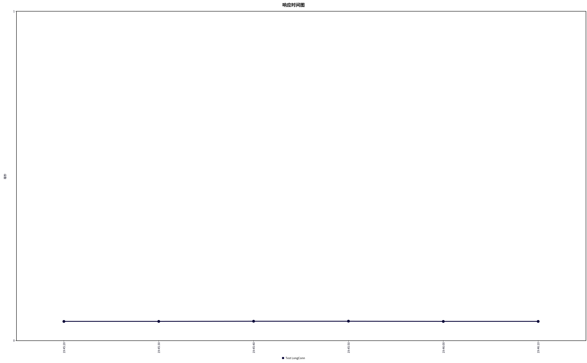
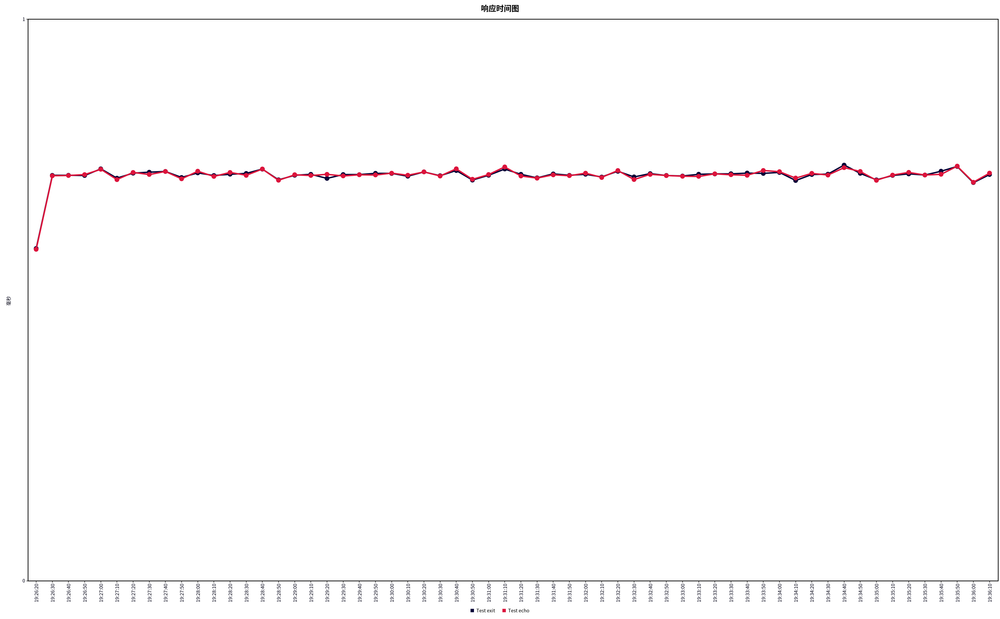

<center><a href="README.md">简体中文</a> | <a href="README_en.md">English</a></center>

# 概述

​	本项目是基于C++17的，对Muduo库部分核心网络组件的去Boost化重写

​	项目框架是跟着施磊老师的手写C++ Muduo网络库项目课程所完成

​	跟写过程的课程笔记可以阅读[Muduo学习笔记.md](./assets/docs/MyMuduo学习笔记.md)

​	跟写完成后本人将C++标准从课程的11提升到了17，并重写了一个日志类，以及将std::bind尽数改造为lambda形式，且修正了课程代码在高并发下的bug以及做了部分优化

​	该项目目前仅供学习使用，本人后续会基于该库尝试开发项目，随着项目开发对库进行修正或扩充


# 构建

​	项目目前有一个构建脚本autobuild.sh，该脚本最多接受一个参数

​	1、autobuild.sh ON 或 autobuild.sh

​	此构建方式将全量构建项目，包括HTTP服务器，构建前请确保 `/usr/local/include` 下有llhttp的头文件以及 `/usr/local/lib` 下有llhttp的动态链接库

​	2、autobuild.sh OFF

​	此构建方式将仅构建项目的核心网络模块，排除HTTP等拓展

​	两种构建方式下，脚本均会将编译获得的动态库拷贝到/usr/lib下，会将项目所有头文件拷贝到/usr/include/explore下


# 使用

​	本项目的使用与Muduo并无太大区别，只是依照现代CPU的性能，本人将默认启动的子线程调整为了1，也就是说如果不做额外设置的话现在项目启动会默认启动1个mainThread与一个subThread

​	一、创建一个EventLoop作为mainLoop

​	二、创建一个InetAddress并绑定端口号

​	三、创建Server并使用上述两个变量将其初始化，同时注册你自己的回调函数

​	四、调用TcpServer的start函数

​	五、调用mainLoop的loop函数

​	至此，一个简单的Server就已经启动完毕


# 快速开始

```cpp
//简单的Echo服务端
#include <explore/TcpServer.h>
#include <explore/Logger.h>

#include <string>
#include <functional>
#include <signal.h>

class EchoServer
{
public:
    EchoServer(EventLoop *loop,
               const InetAddress &addr,
               const std::string name)
        : server_(loop, addr, name),
          loop_(loop),
          exitStr_("quit")
    {
        // 注册回调函数
        server_.setConnectionCallback([this](const TcpConnectionPtr &conn)
                                      { onConnection(conn); });
        server_.setMessageCallback([this](const TcpConnectionPtr &conn, Buffer *buf, Timestamp time)
                                   { onMessage(conn, buf, time); });

        // 设置合适的线程数量   subThread
        server_.setThreadNum(7);
    }

    void start()
    {
        server_.start();
    }

private:
    // 连接建立或断开的回调
    void onConnection(const TcpConnectionPtr &conn)
    {
        if (conn->connected())
        {
            LOG_INFO("conn UP : %s\n", conn->peerAddress().toIpPort().c_str());
        }
        else
        {
            LOG_INFO("conn Down : %s\n", conn->peerAddress().toIpPort().c_str());
        }
    }

    // 可读写事件回调
    void onMessage(const TcpConnectionPtr &conn,
                   Buffer *buf,
                   Timestamp time)
    {
        conn->send(buf->peek(), buf->readableBytes());
        buf->retrieveAll();
    }

    EventLoop *loop_; // mainLoop
    TcpServer server_;
    std::string exitStr_;
};

int main(void)
{
    ::signal(SIGPIPE, SIG_IGN);

    Logger::instance().setLevel(LogLevel::NONE);
    // Logger::instance().setTerminal(false);
    // Logger::instance().enableFileLog("echoServer");
    // Logger::instance().setFastRefresh(true);

    EventLoop loop;
    InetAddress addr(8000);
    EchoServer server(&loop, addr, "EchoServer-01"); // Acceptor non-blocking listenfd create bind
    server.start();                                  // listen loopthread listenfd -> acceptChannel -> mainLoop -> newConnection
    loop.loop();                                     // 启动mainLoop的底层Poller

    return 0;
}
```

编译命令（GCC）

```bash
g++ -o echoServer echoServer.cpp -lexplore -lpthread -g -std=c++17
```

运行

```bash
./echoServer
```

连接

```bash
telnet 127.0.0.1 8000
```


# 测试

​	我创建了一个简单的EchoServer进行压测，该server会在收到消息后原样回送

​	测试环境：i7-12700H(10核20线程)、ubuntu22.04、JMeter5.6.3		

​	Server设置：关闭日志输出，开启7个subThread

​	共进行了两种测试

## 1、长连接吞吐测试

​	Jmeter测试参数：12线程，循环次数永远，测试60s，启用连接复用，禁用关闭连接

​	测试结果如下：

聚合报告：

| Label         | # 样本  | 平均值 | 中位数 | 90% 百分位 | 95% 百分位 | 99% 百分位 | 最小值 | 最大值 | 异常 % | 吞吐量      | 接收 KB/sec | 发送 KB/sec |
| ------------- | ------- | ------ | ------ | ---------- | ---------- | ---------- | ------ | ------ | ------ | ----------- | ----------- | ----------- |
| Test LongConn | 8909511 | 0      | 0      | 0          | 1          | 1          | 0      | 21     | 0.00%  | 148486.9004 | 4785.22     | 0           |
| 总体          | 8909511 | 0      | 0      | 0          | 1          | 1          | 0      | 21     | 0.00%  | 148486.9004 | 4785.22     | 0           |

汇总报告：

| Label         | # 样本  | 平均值 | 最小值 | 最大值 | 标准偏差 | 异常 % | 吞吐量      | 接收 KB/sec | 发送 KB/sec | 平均字节数 |
| ------------- | ------- | ------ | ------ | ------ | -------- | ------ | ----------- | ----------- | ----------- | ---------- |
| Test LongConn | 8909511 | 0      | 0      | 21     | 0.26     | 0.00%  | 148486.9004 | 4785.22     | 0           | 33         |
| 总体          | 8909511 | 0      | 0      | 21     | 0.26     | 0.00%  | 148486.9004 | 4785.22     | 0           | 33         |

响应时间图：




## 2、短连接稳定性测试

​	Jmeter测试参数：12线程，循环次数永远，测试600s，分两个取样器，Echo客户端会向服务器发送一次消息（"hello,here is JMeter"）后断开连接，Exit客户端在连接上后会直接断开连接，均不使用连接复用设置

​	测试结果如下：

聚合报告：

| Label     | # 样本  | 平均值 | 中位数 | 90% 百分位 | 95% 百分位 | 99% 百分位 | 最小值 | 最大值 | 异常 % | 吞吐量      | 接收 KB/sec | 发送 KB/sec |
| --------- | ------- | ------ | ------ | ---------- | ---------- | ---------- | ------ | ------ | ------ | ----------- | ----------- | ----------- |
| Test exit | 4634674 | 0      | 0      | 1          | 5          | 6          | 0      | 26     | 0.00%  | 7724.43092  | 7.54        | 0           |
| Test echo | 4634669 | 0      | 0      | 1          | 5          | 6          | 0      | 22     | 0.00%  | 7724.43546  | 158.41      | 0           |
| 总体      | 9269343 | 0      | 0      | 1          | 5          | 6          | 0      | 26     | 0.00%  | 15448.82776 | 165.95      | 0           |

汇总报告：

| Label     | # 样本  | 平均值 | 最小值 | 最大值 | 标准偏差 | 异常 % | 吞吐量      | 接收 KB/sec | 发送 KB/sec | 平均字节数 |
| --------- | ------- | ------ | ------ | ------ | -------- | ------ | ----------- | ----------- | ----------- | ---------- |
| Test exit | 4634674 | 0      | 0      | 26     | 1.41     | 0.00%  | 7724.43092  | 7.54        | 0           | 1          |
| Test echo | 4634669 | 0      | 0      | 22     | 1.41     | 0.00%  | 7724.43546  | 158.41      | 0           | 21         |
| 总体      | 9269343 | 0      | 0      | 26     | 1.41     | 0.00%  | 15448.82776 | 165.95      | 0           | 11         |

响应时间图：




# 协议支持

## 1、HTTP支持

​	详细可阅读[HTTP.md](./assets/docs/HTTP.md)


# 后续计划

​	1、会基于Linux定时器补充Timer类，并基于此实现异步日志与监控线程（Monitor）

​	2、基于llhttp库尝试扩展对http协议的支持（初步完成）

​	3、扩充对IPV6的支持（待定）
