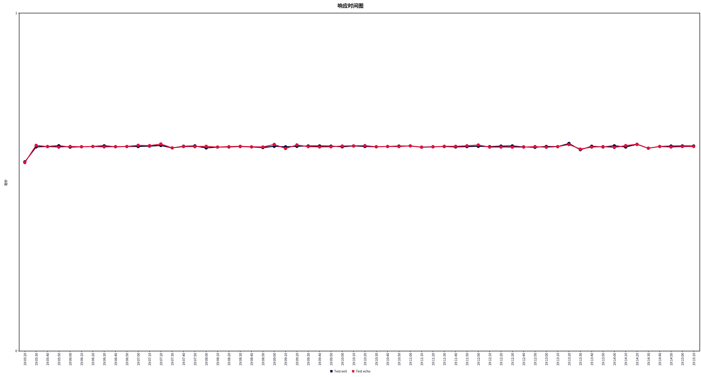

<center><a href="README.md">简体中文</a> | <a href="README_en.md">English</a></center>

# Overview

This project is a reimplementation of part of the Muduo library's core network components with C++17, removing Boost dependencies.

The project framework follows Prof. Shi Lei's hand-written C++ Muduo network library course.

Notes taken during the course can be found in [MyMuduo学习笔记.md](./MyMuduo学习笔记.md).

After completing the course, I upgraded the C++ standard from C++11 to C++17, rewrote a logging class, converted all `std::bind` to lambda expressions, fixed bugs in the course code under high concurrency scenarios, and made some optimizations.

This project is currently for learning purposes only. I plan to develop projects based on this library and will make corrections or extensions to the library as projects progress.


# Build

Run the `autobuild.sh` script in the explore directory. The script will copy the compiled dynamic libraries to `/usr/lib` and copy all project headers to `/usr/include/explore`.


# Usage

The usage of this project is similar to Muduo. However, according to modern CPU performance, I have adjusted the default number of worker threads to 1. This means that without additional configuration, the project will now start with 1 mainThread and 1 subThread by default.

1. Create an EventLoop as the mainLoop
2. Create an InetAddress and bind the port number
3. Create a Server and initialize it with the above two variables, while registering your own callback functions
4. Call the TcpServer's start function
5. Call the mainLoop's loop function

At this point, a simple server has been started.


# Quick Start

```cpp
// Simple Echo Server
#include <explore/TcpServer.h>
#include <explore/Logger.h>

#include <string>
#include <functional>
#include <signal.h>

class EchoServer
{
public:
    EchoServer(EventLoop *loop,
               const InetAddress &addr,
               const std::string name)
        : server_(loop, addr, name),
          loop_(loop),
          exitStr_("quit")
    {
        // Register callback functions
        server_.setConnectionCallback([this](const TcpConnectionPtr &conn)
                                      { onConnection(conn); });
        server_.setMessageCallback([this](const TcpConnectionPtr &conn, Buffer *buf, Timestamp time)
                                   { onMessage(conn, buf, time); });

        // Set appropriate number of threads (subThread)
        server_.setThreadNum(7);
    }

    void start()
    {
        server_.start();
    }

private:
    // Callback for connection establishment or termination
    void onConnection(const TcpConnectionPtr &conn)
    {
        if (conn->connected())
        {
            LOG_INFO("conn UP : %s\n", conn->peerAddress().toIpPort().c_str());
        }
        else
        {
            LOG_INFO("conn Down : %s\n", conn->peerAddress().toIpPort().c_str());
        }
    }

    // Readable/writable event callback
    void onMessage(const TcpConnectionPtr &conn,
                   Buffer *buf,
                   Timestamp time)
    {
        std::string msg = buf->retrieveAllAsStringTrimmed();

        LOG_INFO("receive message:%s", msg.c_str());

        if (msg == exitStr_)
            conn->shutdown();
        else
            conn->send(msg + "\n");
    }

    EventLoop *loop_;   // mainLoop
    TcpServer server_;
    std::string exitStr_;
};

int main(void)
{
    ::signal(SIGPIPE, SIG_IGN);

    Logger::instance().setTerminal(false);
    EventLoop loop;
    InetAddress addr(8000);
    EchoServer server(&loop, addr, "EchoServer-01"); // Acceptor non-blocking listenfd create bind
    server.start();                                  // listen loopthread listenfd -> acceptChannel -> mainLoop -> newConnection
    loop.loop();                                     // Start mainLoop's underlying Poller

    return 0;
}
```

Compile command (GCC)

```bash
g++ -o echoServer echoServer.cpp -lexplore -lpthread -g
```

Run

```bash
./echoServer
```

Connect

```bash
telnet 127.0.0.1 8000
```


# Testing

I created a simple EchoServer for stress testing. This server only sends "OK\n" upon receiving a message.

Test environment: i7-12700H (10 cores 20 threads), Ubuntu 22.04, JMeter 5.6.3

JMeter test parameters: 10 threads, infinite loops, 600s test duration, two samplers. The Echo client sends a message ("hello,here is JMeter") to the server and then disconnects. The Exit client disconnects immediately after connecting. Connection reuse was not enabled for either.

Server settings: Logging output disabled, 7 subThreads enabled

Test results are as follows:

Aggregate Report:

| Label     | # Samples | Average | Median | 90th Percentile | 95th Percentile | 99th Percentile | Min | Max | Error % | Throughput | Received KB/sec | Sent KB/sec |
| --------- | --------- | ------- | ------ | --------------- | --------------- | --------------- | --- | --- | ------- | ---------- | --------------- | ----------- |
| Test exit | 4560109   | 0       | 0      | 1               | 4               | 6               | 0   | 19  | 0.00%   | 7600.169   | 22.27           | 0           |
| Test echo | 4560102   | 0       | 0      | 1               | 4               | 6               | 0   | 19  | 0.00%   | 7600.19533 | 22.27           | 0           |
| Total     | 9120211   | 0       | 0      | 1               | 4               | 6               | 0   | 19  | 0.00%   | 15200.32633| 44.53           | 0           |


Summary Report:

| Label     | # Samples | Average | Min | Max | Std. Deviation | Error % | Throughput | Received KB/sec | Sent KB/sec | Avg. Bytes |
| --------- | --------- | ------- | --- | --- | -------------- | ------- | ---------- | --------------- | ----------- | ---------- |
| Test exit | 4560109   | 0       | 0   | 19  | 1.24           | 0.00%   | 7600.169   | 22.27           | 0           | 3          |
| Test echo | 4560102   | 0       | 0   | 19  | 1.24           | 0.00%   | 7600.19533 | 22.27           | 0           | 3          |
| Total     | 9120211   | 0       | 0   | 19  | 1.24           | 0.00%   | 15200.32633| 44.53           | 0           | 3          |


Response Time Graph:




# Future Plans

1. Implement a Timer class based on the Linux timer, and use it to implement asynchronous logging and a monitoring thread (Monitor)

2. Attempt to extend HTTP protocol support based on the llhttp library

3. Expand IPv6 support (TBD)
