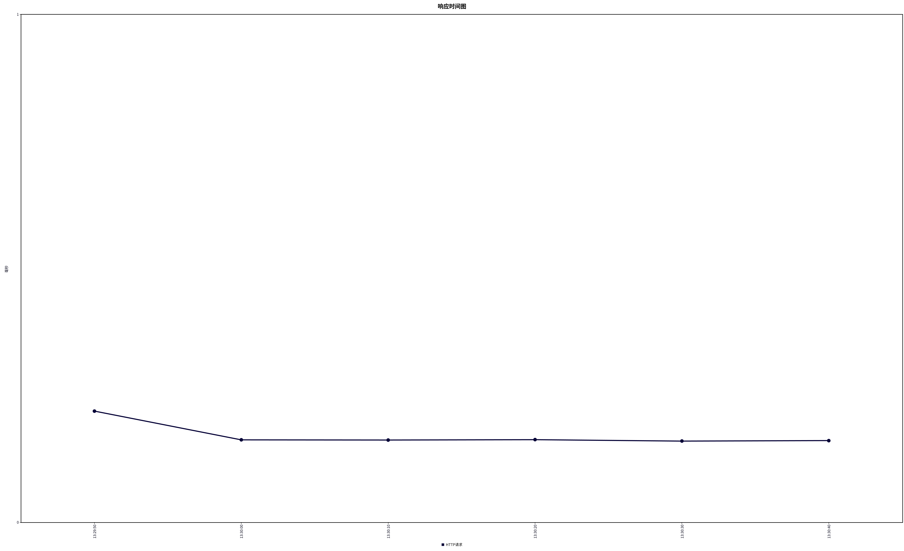

<center><a href="HTTP.md">简体中文</a> | <a href="HTTP_en.md">English</a></center>


HTTP支持依托于llhttp开源库

llhttp项目地址：https://github.com/nodejs/llhttp


# 使用

​	HttpServer的使用整体与TcpServer相似

​	一、创建一个EventLoop作为mainLoop

​	二、创建一个InetAddress并绑定端口号

​	三、创建HttpServer并使用上述两个变量将其初始化，注册你自己的请求分发函数

​	四、调用HttpServer的start函数

​	五、调用HttpServer的loop函数

​	至此，HttpServer就启动完毕，后续新请求到来并解析完成后会调用你注册的请求分发函数，你可以在请求分发函数内拿到完整的请求，并进行自己的业务处理。


# 快速开始

```c++
#include <signal.h>

#include <explore/HttpServer.h>

void requestAcceptor(const TcpConnectionPtr &conn, const HttpRequest req)
{
    // 构建简单的 HTTP 响应
    HttpResponse response;

    response.setBody("<h1>Hello from C++17 Network Library!</h1><p>You requested: " + req.url + "</p>");
    response.setVersion("HTTP/1.1");
    response.setStatusCode(HttpStatusCode::k200OK);
    response.setStatusMessage("Content-Type: text/html");

    Buffer buf;
    response.writeToBuffer(&buf);
    conn->send(&buf);
}

int main()
{
    ::signal(SIGPIPE, SIG_IGN);

    EventLoop loop;
    InetAddress addr(8080);

    Logger::instance().setLevel(LogLevel::NONE);

    HttpServer server(&loop, addr);

    server.setRequestAcceptor(requestAcceptor);
  
    server.setThreadNum(7);

    server.start();
    loop.loop();

    return 0;
}
```


# 测试

​	测试环境：i7-12700H(10核20线程)、ubuntu22.04、JMeter5.6.3		

​	Server设置：关闭日志输出，开启7个subThread

​	测试代码即快速开始中的代码

​	Jmeter测试参数：20线程，循环次数永远，测试60s

​	测试结果如下

聚合报告：

| Label    | # 样本  | 平均值 | 中位数 | 90% 百分位 | 95% 百分位 | 99% 百分位 | 最小值 | 最大值 | 异常 % | 吞吐量      | 接收 KB/sec | 发送 KB/sec |
| -------- | ------- | ------ | ------ | ---------- | ---------- | ---------- | ------ | ------ | ------ | ----------- | ----------- | ----------- |
| HTTP请求 | 5694963 | 0      | 0      | 1          | 1          | 1          | 0      | 75     | 0.00%  | 95123.73683 | 14305.72    | 11240.21    |
| 总体     | 5694963 | 0      | 0      | 1          | 1          | 1          | 0      | 75     | 0.00%  | 95123.73683 | 14305.72    | 11240.21    |

汇总报告：

| Label    | # 样本  | 平均值 | 最小值 | 最大值 | 标准偏差 | 异常 % | 吞吐量      | 接收 KB/sec | 发送 KB/sec | 平均字节数 |
| -------- | ------- | ------ | ------ | ------ | -------- | ------ | ----------- | ----------- | ----------- | ---------- |
| HTTP请求 | 5694963 | 0      | 0      | 75     | 0.46     | 0.00%  | 95123.73683 | 14305.72    | 11240.21    | 154        |
| 总体     | 5694963 | 0      | 0      | 75     | 0.46     | 0.00%  | 95123.73683 | 14305.72    | 11240.21    | 154        |

响应时间图：




# HttpResponse成员函数

1、void setStatusCode(HttpStatusCode statusCode) { statusCode_ = statusCode; }

​	设置响应状态码

2、void setStatusMessage(const std::string &message) { statusMessage_ = message; }

​	设置响应状态信息

3、void setVersion(const std::string &version) { version_ = version; }

​	设置HTTP版本

4、void setHeaders(const std::unordered_map<std::string, std::string> &headers) { headers_ = headers; }

​	设置响应头

5、void addHeaders(const std::string &key, const std::string &value) { headers_.insert_or_assign(key, value); }

​	追加响应头

6、void setBody(std::string body) { body_ = std::move(body); }

​	设置响应体

7、void setCloseConnection(bool close) { closeConnection_ = close; }

​	设置关闭连接标志

8、void writeToBuffer(Buffer *output);

​	组装响应报文到output中